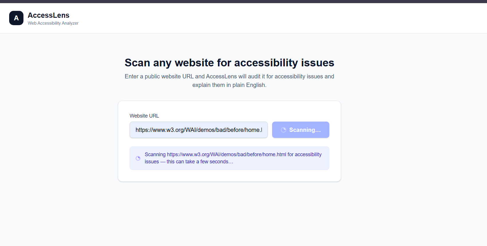
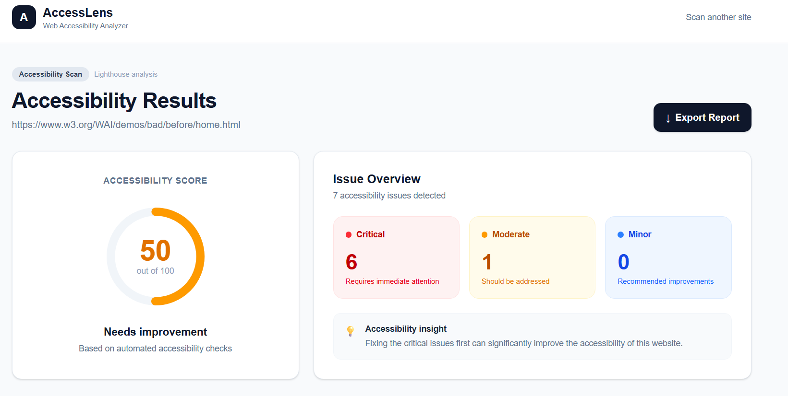
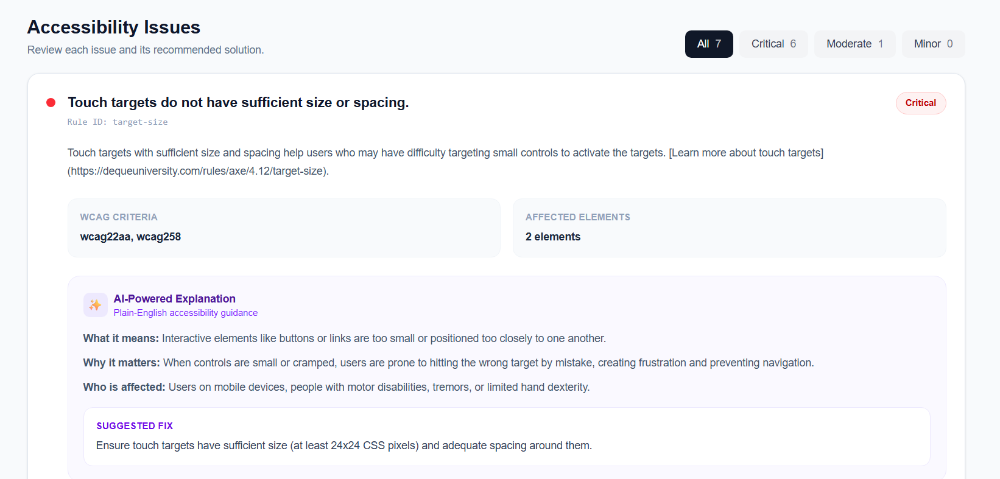
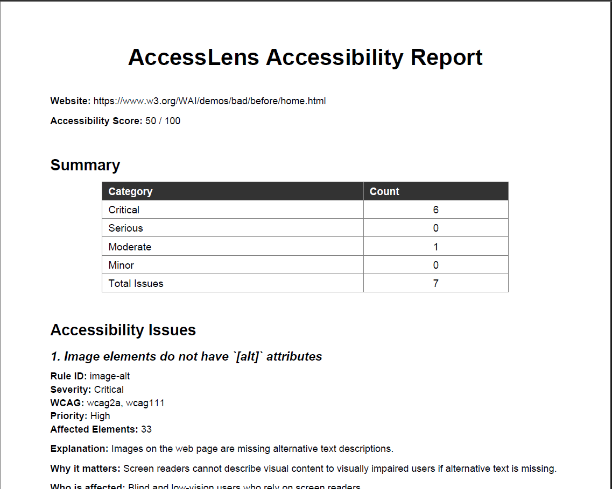

# ♿ AccessLens


### AI-Powered Web Accessibility Assistant

**Making the web understandable, actionable, and accessible --- one
website at a time.**

**HackMatrix 2K26 · Team NEXORA**

[🌐 Live Demo](https://accesslens-nine.vercel.app/) · [📂 GitHub
Repository](https://github.com/shreelakshmiprabhu0-ui/hackmatrix-2026-acesslens)


> AccessLens scans websites for accessibility violations, translates
> complex WCAG findings into plain English, prioritizes what matters
> most, and provides actionable code-level fixes --- so developers can
> actually fix accessibility issues instead of just receiving another
> technical report.

------------------------------------------------------------------------

## 📊 Project Presentation

📄 **[View / Download Project PPT](AccessLens.pptx)**

## 🎥 Demo Video

▶️ **[Watch the AccessLens Demo Video](YOUR_DEMO_VIDEO_LINK)**

## 📚 Project Documentation

📄 **[View Project Documentation](AccessLens_HackMatrix2K26_Documentation.pdf)**

------------------------------------------------------------------------

## 🎯 The Problem

Millions of websites remain inaccessible to people with visual, motor,
and cognitive disabilities.

Although accessibility auditing tools can detect technical violations,
their reports can be difficult for beginners, students, startups, and
small development teams to understand.

Developers are often left asking:

-   What does this violation actually mean?
-   Why does it matter?
-   How serious is it?
-   What should I change in my code?
-   How do I make sure the fix follows WCAG guidelines?

### The gap

**Detection is not the same as understanding.**

AccessLens bridges that gap.

------------------------------------------------------------------------

## 💡 Our Solution

**AccessLens** is an AI-powered accessibility assistant that converts
technical accessibility audit results into clear, prioritized,
developer-friendly actions.

Instead of simply reporting:

> `Image elements do not have [alt] attributes`

AccessLens helps the developer understand:

-   🧠 What the issue means
-   ⚠️ Why it matters
-   📌 How severe it is
-   💻 How to fix it
-   📚 What accessibility principle it relates to

### The Core Idea

``` text
Technical Accessibility Data
            ↓
      AccessLens Engine
            ↓
   AI-Powered Explanation
            ↓
   Prioritized Recommendations
            ↓
       Code-Level Fixes
            ↓
   More Accessible Websites
```

------------------------------------------------------------------------

## ⚙️ How AccessLens Works

### Step 1 --- Enter Website URL

The developer provides the URL of a publicly accessible website.

### Step 2 --- Accessibility Scan

AccessLens performs an automated accessibility audit using the
accessibility scanning infrastructure.

### Step 3 --- Detect Violations

The system identifies accessibility violations and maps them to relevant
WCAG criteria.

### Step 4 --- AI Explanation

The detected issues are passed through the AI-powered accessibility
assistant.

Technical findings are transformed into clear, understandable
explanations.

### Step 5 --- Prioritize Issues

Issues are organized according to severity:

-   🔴 **Critical**
-   🟠 **Moderate**
-   🔵 **Minor**

This helps developers focus on the problems that matter most first.

### Step 6 --- Generate Fixes

AccessLens provides practical, code-level recommendations to help
developers resolve detected accessibility issues.

### Step 7 --- Accessibility Dashboard

The dashboard presents:

-   📊 Accessibility score
-   🔢 Issue count
-   ⚠️ Severity distribution
-   📋 WCAG criteria
-   🎯 Affected elements
-   🤖 AI-powered explanations
-   💻 Recommended fixes

### Step 8 --- Export Report

Developers can export the accessibility analysis as a downloadable
report for documentation, review, or further development.

------------------------------------------------------------------------

## ✨ Key Features

  -----------------------------------------------------------------------
  Feature                             Description
  ----------------------------------- -----------------------------------
  🔍 **Automated Accessibility Scan** Scan a public website for
                                      accessibility issues

  🤖 **AI-Powered Explanations**      Converts technical findings into
                                      plain-English explanations

  ⚠️ **Severity Prioritization**      Separates critical, moderate, and
                                      minor issues

  💻 **Code-Level Fix Suggestions**   Provides actionable recommendations
                                      for developers

  📊 **Accessibility Score**          Provides an easy-to-understand
                                      overview of website accessibility

  📋 **WCAG Mapping**                 Connects detected violations to
                                      relevant WCAG criteria

  🎯 **Affected Element Details**     Shows which elements are
                                      responsible for each issue

  📚 **Accessibility Guidance**       Helps developers understand
                                      accessibility concepts

  📄 **Exportable Reports**           Generates downloadable
                                      accessibility reports

  🌐 **Web-Based Interface**          Provides accessibility analysis
                                      through a web interface
  -----------------------------------------------------------------------

------------------------------------------------------------------------

## 🧠 AI-Powered Accessibility Assistance

Traditional accessibility tools are excellent at **finding problems**.

AccessLens focuses on the next question:

> **"Okay... now what do I do about it?"**

For every detected issue, AccessLens provides contextual guidance
around:

### What It Means

A plain-English explanation of the accessibility problem.

### Why It Matters

Explains how the issue can affect users, particularly people who rely on
assistive technologies.

### How to Fix It

Provides practical guidance and code-level recommendations.

### Accessibility Context

Connects the issue to relevant accessibility and WCAG concepts.

This makes AccessLens useful not only as an auditing tool, but also as
an **accessibility learning assistant**.

------------------------------------------------------------------------

## 🏗️ Architecture

``` text
                         ┌─────────────────────┐
                         │     Developer       │
                         │     Website URL     │
                         └──────────┬──────────┘
                                    │
                                    ▼
                         ┌─────────────────────┐
                         │     AccessLens      │
                         │      Frontend       │
                         │ React + Tailwind CSS│
                         └──────────┬──────────┘
                                    │
                                    ▼
                         ┌─────────────────────┐
                         │       FastAPI       │
                         │       Backend       │
                         │        Python       │
                         └──────────┬──────────┘
                                    │
                  ┌─────────────────┴─────────────────┐
                  │                                   │
                  ▼                                   ▼
       ┌─────────────────────┐             ┌─────────────────────┐
       │ Accessibility       │             │     Gemini API      │
       │ Scanning Engine     │             │  AI Explanation     │
       │ Lighthouse /        │             │  & Recommendations  │
       │ PageSpeed Insights  │             └──────────┬──────────┘
       └──────────┬──────────┘                        │
                  │                                   │
                  └─────────────────┬─────────────────┘
                                    ▼
                         ┌─────────────────────┐
                         │      Analysis &     │
                         │     Prioritization  │
                         └──────────┬──────────┘
                                    │
                                    ▼
                         ┌─────────────────────┐
                         │      AccessLens     │
                         │   Results Dashboard │
                         └──────────┬──────────┘
                                    │
                         ┌──────────┴──────────┐
                         ▼                     ▼
                ┌────────────────┐    ┌────────────────┐
                │ AI Fix         │    │ Export Report  │
                │ Suggestions    │    │                │
                └────────────────┘    └────────────────┘
```

------------------------------------------------------------------------

## 🛠️ Technology Stack

### Frontend

-   React
-   JavaScript
-   JSX
-   HTML5
-   CSS3
-   Tailwind CSS
-   Vite

### Backend

-   Python
-   FastAPI
-   Uvicorn
-   REST APIs

### Accessibility Engine

-   Lighthouse
-   Google PageSpeed Insights API
-   WCAG
-   Accessibility audit data

### AI Layer

-   Google Gemini API
-   AI-powered explanations
-   Accessibility guidance
-   Fix recommendations

### Deployment

-   **Vercel** --- Frontend
-   **Render** --- Backend

### Development & Configuration

-   Git
-   GitHub
-   JSON
-   Environment Variables
-   Markdown

------------------------------------------------------------------------

## 💻 Languages & Formats Used

  Language / Format   Usage
  ------------------- -----------------------------------------------------
  🐍 **Python**       Backend, FastAPI APIs, and accessibility processing
  🟨 **JavaScript**   Frontend application logic and API integration
  ⚛️ **JSX**          React components and UI
  🌐 **HTML5**        Web structure
  🎨 **CSS3**         Styling
  🟦 **JSON**         API data, configuration, and mock data
  📝 **Markdown**     Documentation

---------------------------------------------------------------------------

## 🤖 AI Usage Disclosure

In accordance with the HackMatrix 2026 guidelines, we are disclosing the AI tools used during the development of AccessLens.

### AI Tools Used During Development

| Tool | Purpose |
|---|---|
| **ChatGPT** | Development assistance, debugging, code review, troubleshooting, documentation, and technical guidance |
| **Claude** | Development assistance, code review, debugging, and problem-solving |

These tools were used as development assistants. The team reviewed, adapted, tested, and integrated the generated suggestions into the project.

### AI Used Within the Project

| Technology | Purpose |
|---|---|
| **Google Gemini API** | Generates plain-English explanations, accessibility guidance, and actionable recommendations for detected accessibility violations |

The AI-generated outputs used within AccessLens are processed as part of the application's accessibility-assistance workflow and presented to the developer through the results dashboard.

> **Transparency Statement:** AI tools were used to assist the development process, but the final architecture, implementation, integration, testing, and project decisions were reviewed and carried out by the team.

---------------------------------------------------------------------------

## 📸 Screenshots

### 🏠 AccessLens Home

The landing interface allows developers to enter a public website URL
and start an accessibility scan.



------------------------------------------------------------------------

### 📊 Accessibility Results

The results dashboard provides:

-   Overall accessibility score
-   Critical issues
-   Moderate issues
-   Minor issues
-   WCAG criteria
-   Affected elements
-   Issue descriptions



------------------------------------------------------------------------

### 🤖 AI-Powered Explanation

AccessLens transforms technical accessibility violations into
plain-English explanations and actionable guidance.



------------------------------------------------------------------------

### 📄 Accessibility Report

The report provides a structured summary of the accessibility analysis
and detected issues.



------------------------------------------------------------------------

## 🚀 Running AccessLens Locally

### 1. Clone the Repository

``` bash
git clone https://github.com/shreelakshmiprabhu0-ui/hackmatrix-2026-acesslens.git
cd hackmatrix-2026-acesslens
```

### 2. Backend Setup

``` bash
cd backend
```

Create a virtual environment:

``` powershell
python -m venv .venv
```

Activate it:

``` powershell
.venv\Scripts\Activate.ps1
```

Install dependencies:

``` powershell
pip install -r requirements.txt
```

Run the backend:

``` powershell
uvicorn app.main:app --reload --port 8000
```

Backend:

``` text
http://localhost:8000
```

### 3. Frontend Setup

Open another terminal:

``` bash
cd frontend
npm install
```

Configure the frontend environment:

``` env
VITE_API_BASE_URL=http://localhost:8000
VITE_USE_MOCK_DATA=false
```

Start the development server:

``` bash
npm run dev
```

Frontend:

``` text
http://localhost:5173
```

------------------------------------------------------------------------

## 🔐 Environment Variables

### Frontend

``` env
VITE_API_BASE_URL=<BACKEND_URL>
VITE_USE_MOCK_DATA=false
```

### Backend

Configure the required API credentials through environment variables.

> ⚠️ **Never commit API keys or other secrets to GitHub.**

------------------------------------------------------------------------

## 📁 Repository Structure

``` text
hackmatrix-2026-acesslens/
│
├── README.md
├── AcessLens.pptx
│
├── screenshots/
│   ├── home.png
│   ├── results.png
│   ├── ai-explanation.png
│   └── report.png
│
├── frontend/
│   ├── src/
│   │   ├── components/
│   │   ├── pages/
│   │   ├── services/
│   │   ├── mocks/
│   │   └── ...
│   ├── package.json
│   └── ...
│
└── backend/
    ├── app/
    │   ├── main.py
    │   ├── routers/
    │   ├── services/
    │   └── ...
    ├── requirements.txt
    └── ...
```

------------------------------------------------------------------------

## 📦 Project Deliverables

| Deliverable | Link |
|---|---|
| 🌐 **Live Application** | [AccessLens](https://accesslens-nine.vercel.app/) |
| 📄 **Project PPT** | [AcessLens.pptx](AccessLens.pptx) |
| 📚 **Project Documentation** | [View Documentation](AccessLens_HackMatrix2K26_Documentation.pdf) |
| 🎥 **Demo Video** | [Watch Demo](YOUR_DEMO_VIDEO_LINK) |
| 💻 **Source Code** | [GitHub Repository](https://github.com/shreelakshmiprabhu0-ui/hackmatrix-2026-acesslens) |

## 🌍 Deployment

### Frontend

The AccessLens frontend is deployed using **Vercel**.

### Backend

The AccessLens backend is deployed using **Render**.

### Production Flow

``` text
User
 │
 ▼
AccessLens Frontend
 │
 │ REST API
 ▼
AccessLens Backend
 │
 ├── Accessibility Audit
 │
 └── Gemini AI
       │
       ▼
Accessibility Analysis
 │
 ▼
Frontend Dashboard
 │
 ├── AI Explanation
 ├── Fix Suggestions
 └── Export Report
```

------------------------------------------------------------------------

## 🎯 Why AccessLens?

Accessibility tools should not stop at:

> **"Here is what's wrong."**

They should help developers reach:

> **"Here is why it matters --- and here is how to fix it."**

AccessLens reduces the gap between **accessibility detection and
accessibility action**.

It makes accessibility:

-   Easier to understand
-   Easier to prioritize
-   Easier to fix
-   Easier to learn

------------------------------------------------------------------------

## 🌱 Social Impact

AccessLens aims to contribute to a more inclusive digital ecosystem by
helping developers build websites that work better for everyone.

### Impact

-   ♿ Promotes digital inclusion
-   🌐 Encourages accessible web development
-   📚 Makes accessibility easier for beginners to learn
-   ⚡ Reduces the time required to understand accessibility issues
-   📋 Encourages WCAG-aware development
-   💻 Helps developers turn audit results into actionable fixes

------------------------------------------------------------------------

## 🔮 Future Scope

-   🌐 **Browser Extension** --- Scan the current webpage directly from
    the browser.
-   💻 **VS Code Extension** --- Detect accessibility issues while
    developers write code.
-   🔄 **CI/CD Integration** --- Automatically scan websites during
    development and deployment.
-   🏢 **Enterprise Dashboard** --- Track accessibility across multiple
    websites and projects.
-   📈 **Accessibility History** --- Track accessibility scores and
    improvements over time.
-   🤖 **AI-Assisted Remediation** --- Move from recommending fixes
    toward generating safer, developer-reviewed patches.

------------------------------------------------------------------------

## 👥 Team NEXORA

| Member | Role |
|---|---|
| **Shreelakshmi Prabhu** | Frontend & Integration |
| **Shivani B** | Frontend & Backend |
| **Minvitha** | Backend |
| **Diya Sajin** | Presentation & Documentation |
------------------------------------------------------------------------

## 🏁 Conclusion

**AccessLens is more than an accessibility scanner.**

It is an accessibility assistant designed to turn:

``` text
Audit Results
      ↓
Understanding
      ↓
Prioritization
      ↓
Actionable Fixes
      ↓
Accessible Websites
```

Because accessibility should not be a checkbox.

### **It should be built into the web. ♿🌐**

------------------------------------------------------------------------

## 📚 Standards & Technologies

-   WCAG --- Web Content Accessibility Guidelines
-   Lighthouse accessibility auditing
-   Google PageSpeed Insights
-   FastAPI
-   React
-   Tailwind CSS
-   Google Gemini
-   Vercel
-   Render

------------------------------------------------------------------------

## ⭐ Support the Project

If AccessLens helped you understand or improve web accessibility,
consider giving the repository a ⭐.

------------------------------------------------------------------------

::: {align="center"}
### Built with ❤️ by Team NEXORA

**HackMatrix 2K26**
:::
